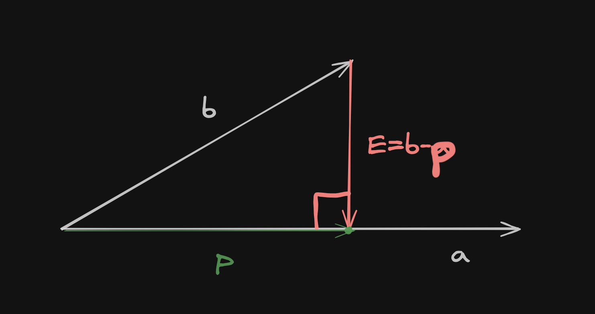

# Projections of Vectors

## Motivation

You might have this question that **What is the need of projection?**

Let us say we are given some data $(x_1,b_1),(x_2,b_2),...(x_n,b_n)$ and it is given that this does not have a solution, i.e., $b\notin C(A).$ At this point, it makes sense to get a projection of $b$ onto $A$.

## Projecting a vector $b$ onto line $a$

$$
\text{We know, }p = \hat{x}a\newline \text{ and } E=b-a\rightarrow E=b-\hat{x}a\\\text{ and } E\perp a \rightarrow b-\hat{x}a\perp a
\\ \rightarrow a(b-\hat{x}a) = 0\\ \rightarrow \hat{x} = \cfrac{a^Tb}{a^Ta}\\
\ \\
\text{Since, }p=\hat{x}a\\\text{Hence, } p = \cfrac{a^Tb}{a^Ta}a
$$

## Projection Matrix $P$
We know $p = \cfrac{a^Tb}{a^Ta}a = \cfrac{aa^T}{a^Ta}b$

Then the Projection Matrix $P=\cfrac{aa^T}{a^Ta}$ and the projection of $b$ onto $a$ is $Pa.$

### Important Observations
1. $P$ is always symmetric.
2. $P^2=P, \text{ i.e, }P^2b=Pb$
3. Column space of $P =$ line through $a$ 
4. Null space of $P=$ plane $\perp a$
5. Rank $P=1$

## Projection onto a subspace

Let us have a system of equations, i.e., $Ax=b$ and $A$ is a $m\text{ x }n$ matrix, where $m>n.$

Let us now see how to project $b$ onto column space $C(A)$

Now projection of $b$ onto $S$ is $p=A\hat{x}.$

We also know that $E=b-p=b-A\hat{x}.$

We can observe that $E\perp\text{every vector in }C(A)$ and we also know that $C(A)\perp N(A^T)$ from [here](./02%20Orthagonal%20Vectors%20and%20Subspaces.md/#caperp-nat)

So we can say that $E\in N(A^T)\newline\to A^TE=0\newline\to A^T(b-A\hat{x}) = 0\newline\to A^TA\hat{x}=A^Tb$

!!! tip

    Even if $Ax=b$ does not have a solution $A^TA\hat{x}=A^Tb$ has a solution

### Important Observations
1. If columns of $A$ are linearly independent, then $A^TA$ is **invertible** as well as **symmetric**. Therefore $A^TA\hat{x}=A^Tb$ becomes $\hat{x}=(A^TA)^{-1}A^Tb.$ So projection becomes $A\hat{x}=A(A^TA)^{-1}A^Tb$

2. If $b\in C(A),$ i.e. $b=Ax$ then the projection is the vector $b$ itself.

3. If $b\in N(A^T),$ i.e. $A^Tb=0$ then the projection $p=0.$

4. If $C(A)=\R^n$ then projection $p=b$

5. The projection matrix is always **symmetric** and satisfies $p^2=p$